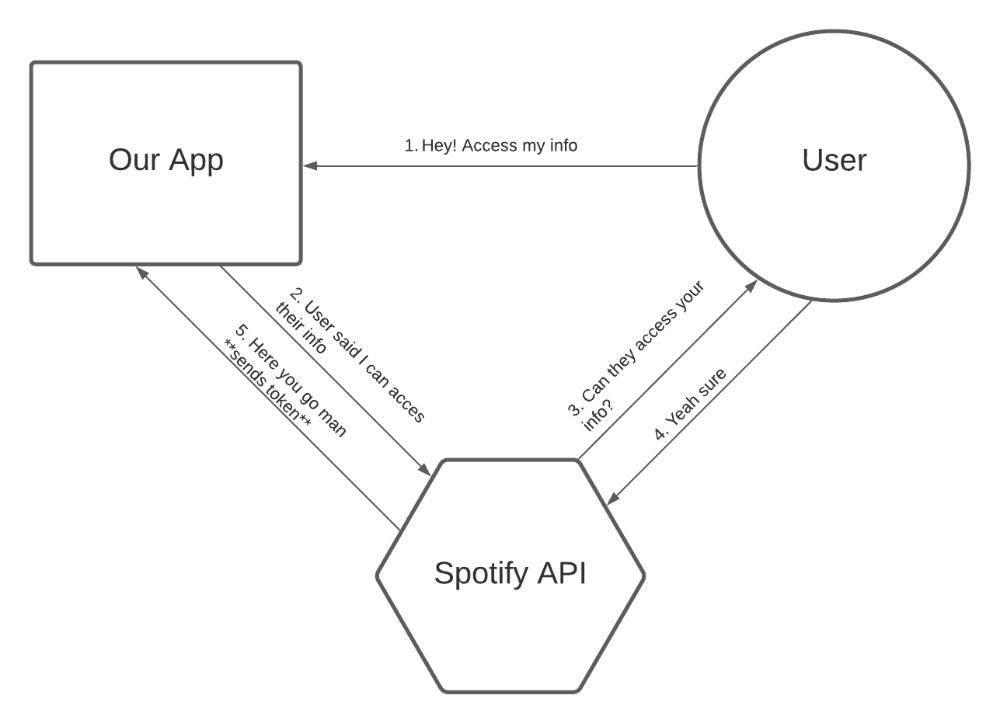

# Spotify API with React Tutorial ⚛🎶
This is a tutorial for my show & tell in the MLH Production Engineering Fellowship.

## Requirements 🧱

### Spotify API credentials:
 - Go to the [Spotify API console](https://developer.spotify.com/dashboard/login) and login with a Spotify account.
 - Create a new application. You'll see you Client_id and Client_secret credentials, will need them later.
 - Go to the app settings and add to Redirect URI's the url: http://localhost:3000/home and save it.

### Create .env
 - Create a .env file in the root directory and add the following with your corresponding credentials:
 ```sh
REACT_APP_CLIENT_ID=<your-client-id>
REACT_APP_CLIENT_SECRET=<your-cliend-secret>
REACT_APP_REDIRECT_URL=http://localhost:3000/home
```

### Npm install
 - After pulling the repo you should do right away ```npm install```


## Checkpoints 🚩
In case you get lost at some point of the tutorial I've created some checkpoint branches which you can change to to keep up with the tutorial. This checkpoints are the following branches:
 - __base__: from here you can start the tutorial. It has a clean starting point.
 - __1-login__: Up to here we have a basic routing, with pages Home and Login.
 - __2-access-token__: Up to here we are able to catch the access_token that the Spotify Auth returns. It is needed to make requests to the Spotify API. 
 - __3-axios-request__: Up to here we have requests to the Spotify API to bring our Spotify profile info, our top songs, top artists, and top playlists and are able to log in in the console.
 - __4-display-data__: Up to here we have a great UI to present the data we've collected.

## Spotify Auth Flow 🚀

<div align="center">
    
</div>

## Spotify API endpoints we use 🔌
 - [Get user's info](https://developer.spotify.com/documentation/web-api/reference/#endpoint-get-current-users-profile)
 - [Top playlists](https://developer.spotify.com/documentation/web-api/reference/#category-playlists)
 - [Top artists](https://developer.spotify.com/documentation/web-api/reference/#category-personalization)
 - [Top tracks](https://developer.spotify.com/documentation/web-api/reference/#category-personalization)
